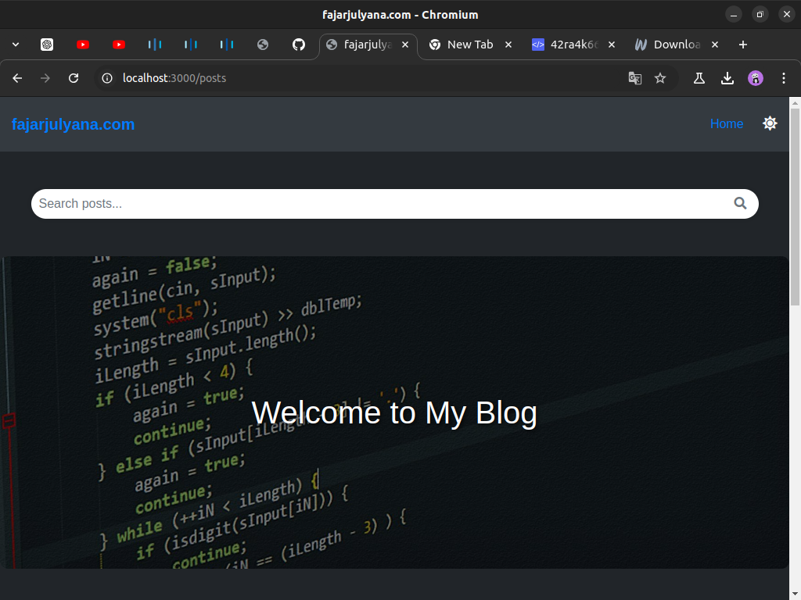

# blog-app-nodejs-mysql


# Blog Application

This is a simple blog application built using Node.js, Express, Sequelize, and MySQL. The application allows users to create, view, and manage blog posts with support for thumbnails.

## Features

- Create, read, update, and delete (CRUD) blog posts.
- Display all blog posts on the homepage, sorted by the most recent.
- Add a thumbnail image link to each post.
- Detailed view of individual posts.
- Admin panel for managing posts.

## Installation

1. **Clone the repository:**
   ```bash
   git clone https://github.com/fajarjulyana/blog-app-nodejs-mysql-native.git
   cd blog-app-nodejs-mysql-native
   ```

2. **Install dependencies:**
   ```bash
   npm install
   ```

3. **Set up the database:**

   - Create a MySQL database named `blogdb`.
   - Use the following SQL to create the `posts` table:
     ```sql
     CREATE TABLE posts (
         id INT AUTO_INCREMENT PRIMARY KEY,
         title VARCHAR(255) NOT NULL,
         content TEXT NOT NULL,
         thumbnail VARCHAR(255),
         createdAt TIMESTAMP DEFAULT CURRENT_TIMESTAMP,
         updatedAt TIMESTAMP DEFAULT CURRENT_TIMESTAMP ON UPDATE CURRENT_TIMESTAMP
     );
     ```

4. **Configure the database:**

   - Ensure that the `config/database.js` file contains the correct MySQL configuration:
     ```javascript
     const { Sequelize } = require('sequelize');

     const sequelize = new Sequelize('blogdb', 'root', '', {
         host: 'localhost',
         dialect: 'mysql'
     });

     module.exports = sequelize;
     ```

5. **Run the application:**
   ```bash
   npm start
   ```

   The server will start on `http://localhost:3000`.

## Usage

- **Homepage:** Displays a list of all posts, sorted by the most recent. Thumbnails and titles are shown with a "Read More" link.
- **Create Post:** Use the `/posts/create` route to add a new post with a title, content, and optional thumbnail link.
- **View Post:** Click on a post title or "Read More" to view the detailed content of the post.

## Admin Panel

An admin panel has been set up to manage blog posts. From the panel, you can:

- View all posts.
- Edit or delete existing posts.

To access the admin panel, navigate to `/admin/posts`.
To access the login, navigate to `/register/`.

## Dependencies

- Node.js
- Express
- Sequelize
- MySQL
- EJS (Embedded JavaScript templating)
- TinyMCE (for rich text editing)

## License

This project is licensed under the MIT License.
